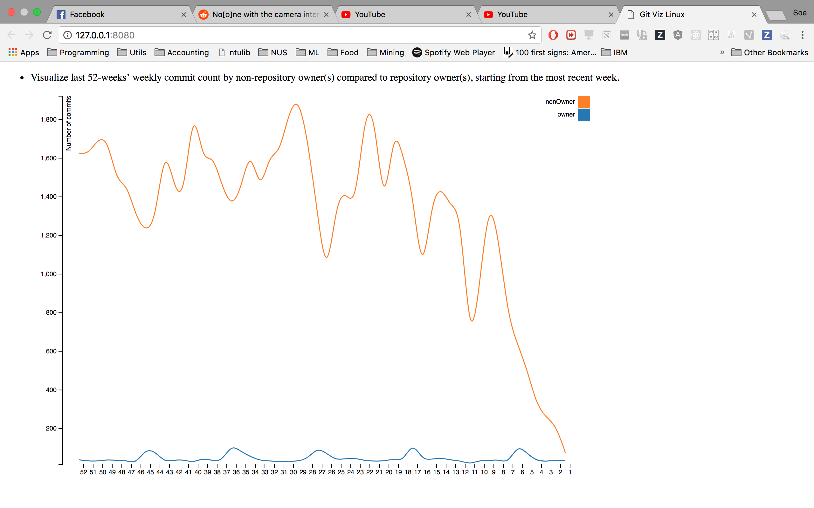
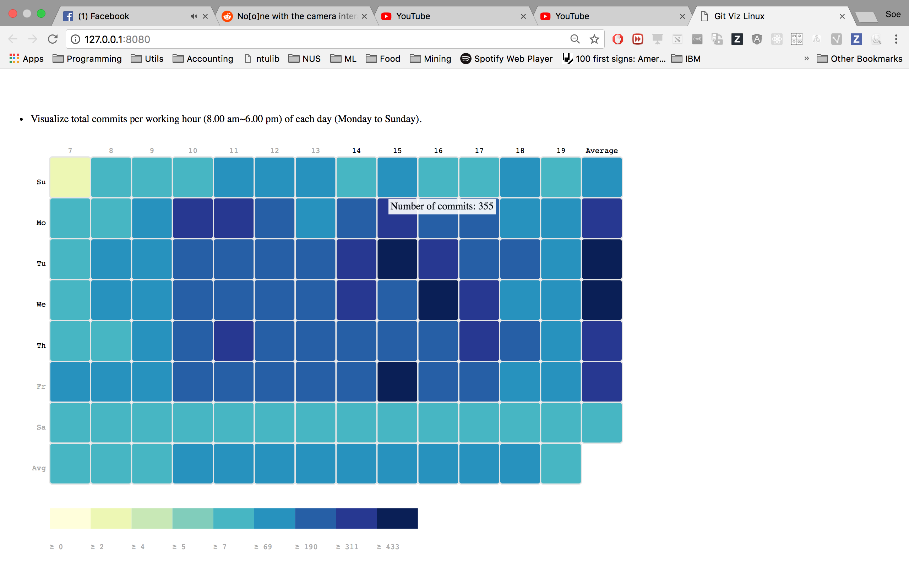
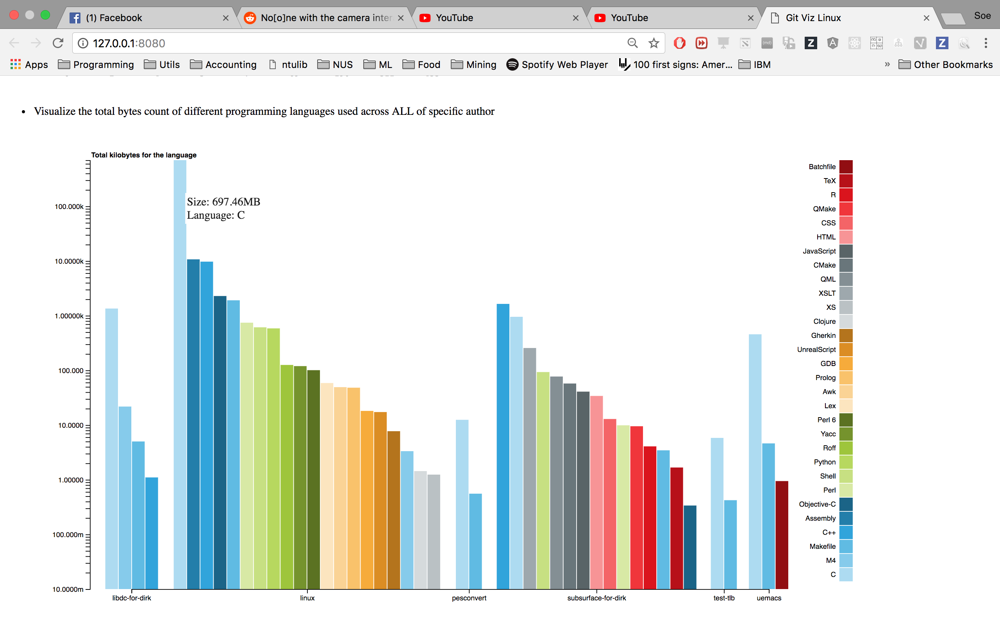

# 1. Introduction 
- The objective of the assignment is to visualize the statistic and user behaviors of contributors working on the linux github repository. Github developer api is used to retrieve the data from `https://github.com/torvalds/linux`. 
- Three main area of user behavoir is analyzed and visualized.
    1. Number of commits per week within a year
    2. What time and date are developers most active on github
    3. Languages used in the repositories of the owner of linux github
## Contributions
- Contributors of this project are:
    1. Yumeng Yin(E0227600)
    2. Shwe Soe Chun (E0210469)
- For every graph, there is a main visualizer and helper.  Yumeng acts as the main visualizer for first and third charts and the second chart is done by Soe Chun. 
- Task and responsibility allocation
    - Type of visualization to use for all objectives are brainstormed together
    - Project Setup, initial data query from api and processing, adding mouse events to the graphs are done by Shwe Soe Chun
    - Yumeng act as the main visualizer and worked on the basics of the graphs used. Further data processing to fit data into d3 format and finalizing the graphs are also done by Yumeng
    - Overall, github is used to host our code.  The code can be found [here](https://github.com/soechun/gitviz)

# 2. Visualization Purpose & Method
| Objective | Visualization |
| :-------: | :-----------: |
| 1 | Line Graph |
| 2 | HeatMap |
| 3 | BarChart |

## 1. Number of commits per week within a year - Line Graph

### Method
  1. The following github [api](https://api.github.com/repos/torvalds/linux/stats/participation) https://api.github.com/repos/torvalds/linux/stats/participation is used together with ajax from jquery. The data is then feed into a function that will do initial data processing.
  2. From the previous data preparation, we have the list of all commits of owners and non-reposiitory owners for all previous 52 months. To show the change trend for owners and non-owners, we select the Line graph.
  3. For each group (owners, non-owners), we draw a line using d3. First we define the X-Axis using d3.scaleBand ranging from week 52 to week 1 and Y-axis as d3.scaleLinear. 
  4. After that lines are drawn using different data points for user data for each month. The legend is added to the right side denoting the color used for different user groups.
### Justification for visualization 
- When we first saw the data, there are 52 weeks worth of data which would be difficult to comprehend in bar charts. and also in comparison line chart would reveal more between the difference between the no. of commits per owner vs non-owners. We can also see the change of user pattern throughout the time. 
### Insight
From the final chart, we can find out that the commit from repository is stable and constant in the previous 52 weeks. The commits from non-owner keep increasing in the previous 52 weeks. The reason of that may be the increase of the number of non-repository users in the previous 52 weeks.

## 2. Time and day when developers are active (in terms of commit) - Heatmap

### Method
    1. The following [github api](https://api.github.com/repos/torvalds/linux/stats/punch_card) https://api.github.com/repos/torvalds/linux/stats/punch_card is used together with ajax from jquery. The data is then feed into a function that do initial data processing.
    2. To visualize total commits per working hour (8.00 am~6.00 pm) of each day (Monday to Sunday), we choose to use heatmap to show the change of commits for different time and different day. 
    3. We further processed the data to include average commits per working hour across every day and average commits per day across every hour. This later comes into help to tell me when the devs are most active.
    4. After connecting all commits counts for different users of each day, we first define the two side of the heatap as Days(Sunday .etc) and Times(the exact time like 8 am). 
    5. After that the range of commits numbers are divided into 9 groups, denoted by nine color, using d3 function d3.scaleQuantile. As example the colors are representing the number of commits for following 9 range (0, 2), (2, 4), (4, 5), (5, 7), (7, 69), (69, 190), (190, 311), (311, 433), (433,)
    6. The block for different day and time will be filled using the different colors defined before according to the number of commits. Last but not least, mouse events are added to all blocks to show the number of commits for the block.
### Justification for visualization 
- For the commits per working hour, we decided to use heatmap as it is easier to compare between the time and the day. The graph can give have insights on which days or time has the most commit.  And also it can give us general insight on which days the users are most active. 
### Insight
- From the heatmap, we can find out that Tuesday 3pm, Wednesday 4pm and Friday 3pm the repo have the most commits. Sataurday have the least commits in the whole week. Moreover, we can conclude that overall, Tuesday and Wednesday are the most active on git among other days.

## 3. Languages used in repositories owned by Linux repository owner - BarChart

Languges per repositories owned by `torvalds`
### Method
    1. The following [github api](https://api.github.com/users/torvalds/repos) https://api.github.com/users/torvalds/repos is used together with ajax from jquery. This api gives the overall data of repositories under torvalds which contains link to language distribution of each repository.  Then we used another ajax query together with those links to gather language info from each repository.
    2. To the total bytes count of different programming languages used across ALL of specific author, we choose to use scatter bar chart so that we can both display the different languages for each repo and compare between different repos. 
    3. For the scatter bar chart, we first get the number of categories of languages used for all repos. After that, one color are selected for each of the langues.
    4. From our insight of the data, the language byte count is bias that C used in linux repo is almost 70 times of the second most language. In this case, for Y-axis we use d3.scaleLog() so that the display for different languages will be balanced. 
    5. For X-axis, since not all languages will exist in all repos, for the plot, only the used language will be plot for each repo. To achieve this, a list of languages contained for different repos is created first and used when defining the x-Axis.
    6. After all preparation, we plot a bar for each language for each repo based on the total count of byte and the color defined for the language.
    7. Last but not least, mouse event are added to the bar to display the bytes and the language for each bar.
### Justification for visualization 
- We found out that there is only countable number of repositories under torvals.  So, It is easier to compare languages across different repositoires. As we used a grouped barchart, it is also easier to compare which language is the most dominant in each repository.  We also used log scale on the Y axis as one of the repository (linux) is a very popular repository with a large number of C code written in it.  So without log scale, we won't be able to comprehend the difference between the rest of the repositories.
### Insight
- From the scatter bar chart we can find out that linux have the most bytes of codes and linux used most languages in the all repos. Linux and subsurface-for-dirk are the top two which have used more languages than other repos.
Language C is used mostly for most of the repos.
In the all repos, repo test-tlb have least codes.